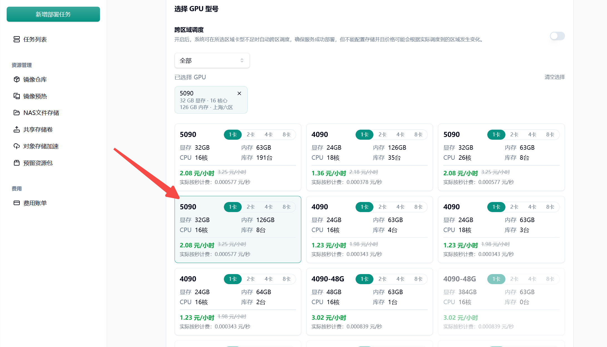
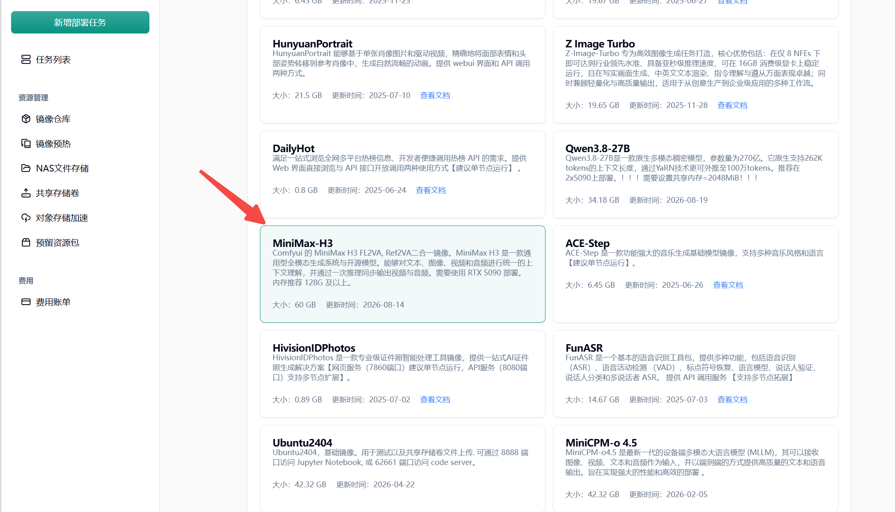
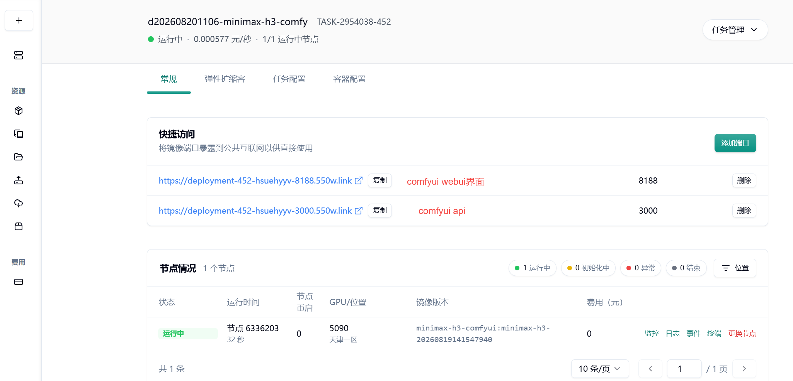
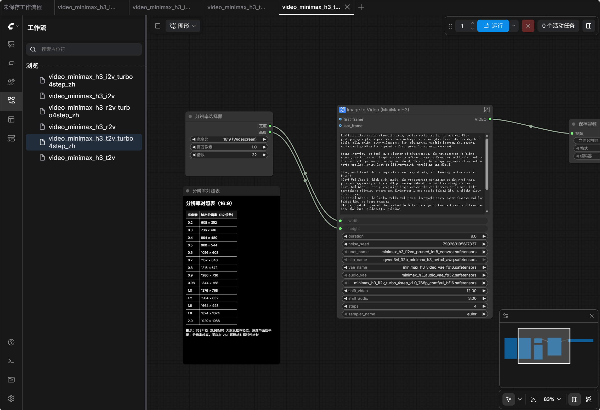

# 容器化部署 MiniMax-H3

## 1.简介

MiniMax H3 是 MiniMax Hailuo 视频系列中的最新模型。它可生成最长 15 秒、24 FPS 的视频，支持原生 32 kHz 立体声音频，覆盖 11 种语言，最高分辨率可达 2K。该模型由 33.1B 密集单流全能变压器（omni transformer）驱动，并配备 Qwen3-VL-32B 文本编码器。

服务支持三种生成模式，均已适配 turbo 4 步加速和满血模型工作流：

- 文生视频（一段文字直接出带音频的视频）

- 图生视频（一张首帧图片驱动画面与运镜）

- 参考生视频（最多 9 张参考图 + 3 段参考视频 + 3 段参考音频，锁定角色形象、画风或音色）

三种模式的模型与用法差异见第 7 节。


## 2.快速上手

首先我们进入 https://console.suanli.cn/serverless/create 创建任务，推荐选用内存较大的 5090 机器。





选择 MiniMax-H3 预制镜像后发布任务





集群有镜像缓存时 1~2分钟 任务即可启动成功





任务启动成功后点击 8188 端口进入 comfyui webui 界面 选择对应工作流即可开始生成视频


## **3.工作流介绍：**




**video_minimax_h3_t2v.json**

输入文字描述，输出带原生音频的视频（最长15秒/24FPS/最高2K）。提示词可写镜头运动、场景内容、对白和音效，模型同步生成画面和声音。支持多镜头剪辑标记、中文对白标签、屏幕文字渲染。采样器 res_multistep，20步，画质最高，速度最慢。

**video_minimax_h3_t2v_turbo4step_zh.json**

功能与原版相同，加载4步蒸馏LoRA + SigmaShift噪声调度，采样器改 euler、步数降到4步，速度约5倍。日常使用推荐。不要在 turbo 档下手动加步数，蒸馏LoRA按4步训练，加步数不会提升画质只会更慢。

**video_minimax_h3_i2v.json**

上传一张起始图作为视频首帧，配合文字描述驱动镜头运动和动态变化，同步生成音频。LoadImage 选图后接到 first_frame 输入口（尾帧引导接 last_frame，可同时使用）。输入图片长宽比尽量与生成分辨率一致。res_multistep，20步。

**video_minimax_h3_i2v_turbo4step_zh.json**

功能与原版相同，加载 fl2v turbo 4步LoRA + SigmaShift，euler/4步，速度约5倍。日常使用推荐。

**video_minimax_h3_r2v.json**
把参考图片、参考视频、参考音频融入生成，锁定角色身份、画风、动作风格或音色。最多9张参考图 + 3段参考视频（可各带音轨）+ 3段独立音频。提示词里用 `<Picture 1>`、`<Video 1>`、`<Audio 1>` 标签引用素材，标签序号对应输入口序号，不是上传顺序。使用 ref2va 模型（与 T2V/I2V 的 fl2va 不同，不可混用），res_multistep，20步。

**video_minimax_h3_r2v_turbo4step_zh.json**

功能与原版相同，加载 ref2v 专用4步LoRA（v0.1，勿与 fl2v 版混用）+ SigmaShift，euler/4步，速度约5倍。ref_image_size 参数可选 match（参考图缩放到生成分辨率，快）或 max（保留最高2048px短边，身份保真更强但慢）。


## 4.API 快速接入


### 4.1 两步快速跑通


**第 1 步**，在共绩算力控制台开一台 GPU 实例，镜像选预置 ComfyUI 0.31.0 和 MiniMax H3 全套模型的组合，模型不用自己下载，GPU 建议 RTX 5090 126GB 档。开通后会拿到两个地址，形如 `deployment-xxxx-8188.550w.link` 和 `deployment-xxxx-3000.550w.link`，代码调用走子域名带 3000 的那个。

**第 2 步**，把下面的脚本整个复制，存成 `quickstart.py`，换成你自己的实例地址，运行。纯 Python 标准库，不用 pip install，也不用下载任何文件。


```Python
# quickstart.py —— MiniMax H3 视频生成最小接入示例（纯标准库，Python 3.8+）
# 用法: python quickstart.py <你的实例地址>
#       示例: python quickstart.py https://deployment-xxxx-3000.550w.link
import json, time, random, base64, os, sys
import urllib.request, urllib.error

# 换成你自己的实例地址（控制台里子域名带 3000 的那个）
BASE_URL = sys.argv[1] if len(sys.argv) > 1 else "https://deployment-xxxx-3000.550w.link"

PROMPT = ("A ginger cat stretches lazily on a windowsill, "
          "sunlight filtering through white sheer curtains onto its fur, "
          "macro close-up, shallow depth of field, warm and cozy")

# MiniMax H3 文生视频工作流：turbo 4 步加速 / 720p 横屏 / 5 秒
# 改分辨率: 节点 6 的 width/height（必须 32 的倍数，如 1080p 竖屏 = 1088x1920）
# 改时长:   节点 6 的 length（帧数：124≈5s，243≈10s，362≈15s）
# 改画质:   删掉节点 15（LoRA）和节点 5（SigmaShift），节点 8 的 model 改接 ["1", 0]、
#           steps 改 20、sampler_name 改 res_multistep（cfg 保持 1.0 不变）
workflow = {
    "1":  {"class_type": "UNETLoader", "inputs": {"unet_name": "minimax_h3_fl2va_pruned_int8_convrot.safetensors", "weight_dtype": "default"}},
    "2":  {"class_type": "CLIPLoader", "inputs": {"clip_name": "qwen3vl_32b_minimax_h3_nvfp4_awq.safetensors", "type": "minimax"}},
    "3":  {"class_type": "VAELoader", "inputs": {"vae_name": "minimax_h3_video_vae_fp16.safetensors"}},
    "4":  {"class_type": "VAELoader", "inputs": {"vae_name": "minimax_h3_audio_vae_fp32.safetensors"}},
    "15": {"class_type": "LoraLoaderModelOnly", "inputs": {"model": ["1", 0], "lora_name": "minimax_h3_fl2v_turbo_4step_v1.0_768p_comfyui_bf16.safetensors", "strength_model": 1.0}},
    "5":  {"class_type": "MiniMaxH3SigmaShift", "inputs": {"model": ["15", 0], "shift_video": 12.0, "shift_audio": 3.0}},
    "6":  {"class_type": "MiniMaxH3ImageToVideo", "inputs": {"clip": ["2", 0], "vae": ["3", 0], "prompt": PROMPT, "width": 1280, "height": 736, "length": 124}},
    "7":  {"class_type": "ConditioningZeroOut", "inputs": {"conditioning": ["6", 0]}},
    "8":  {"class_type": "KSampler", "inputs": {"seed": random.randint(0, 2**32 - 1), "steps": 4, "cfg": 1.0, "sampler_name": "euler", "scheduler": "simple", "model": ["5", 0], "positive": ["6", 0], "negative": ["7", 0], "latent_image": ["6", 1], "denoise": 1.0}},
    "9":  {"class_type": "VAEDecode", "inputs": {"samples": ["8", 0], "vae": ["3", 0]}},
    "10": {"class_type": "VAEDecodeAudio", "inputs": {"samples": ["8", 0], "vae": ["4", 0]}},
    "13": {"class_type": "CreateVideo", "inputs": {"images": ["9", 0], "fps": 24.0, "audio": ["10", 0]}},
    "11": {"class_type": "SaveVideo", "inputs": {"video": ["13", 0], "filename_prefix": "quickstart", "format": "auto", "codec": "auto"}},
    "12": {"class_type": "SaveAudio", "inputs": {"audio": ["10", 0], "filename_prefix": "quickstart"}},
}


def post_json(url, payload, timeout=600, retries=8):
    """POST JSON；实例休眠唤醒期间返回 503，自动重试"""
    body = json.dumps(payload).encode("utf-8")
    for attempt in range(retries):
        try:
            req = urllib.request.Request(url, data=body, headers={"Content-Type": "application/json"}, method="POST")
            with urllib.request.urlopen(req, timeout=timeout) as r:
                return json.loads(r.read())
        except urllib.error.HTTPError as e:
            if e.code == 503 and attempt < retries - 1:
                time.sleep(3)
                continue
            raise


os.makedirs("output", exist_ok=True)
print("生成中（720p / 5 秒 / turbo 档，热启动约 75 秒，首次运行要等模型加载，1 到 5 分钟）...")
result = post_json(BASE_URL + "/prompt", {"prompt": workflow})
for i, item in enumerate(result.get("images", [])):
    raw = base64.b64decode(item)
    if raw[:4] == b"fLaC":
        ext = "flac"        # 独立音轨（成片 mp4 里已内嵌，可忽略）
    elif raw[4:8] == b"ftyp":
        ext = "mp4"         # 成片，音轨已内嵌
    else:
        ext = "bin"
    path = os.path.join("output", "quickstart_%d.%s" % (i, ext))
    with open(path, "wb") as f:
        f.write(raw)
    print("已保存 %s (%.2f MB)" % (path, len(raw) / 1048576))

```


热启动约 75 秒出片，首次运行要等模型加载进显存，1 到 5 分钟，属于正常冷启动。跑完 `output/` 目录里出现一个 MP4（音轨已内嵌，直接播放）和一个 FLAC（独立音轨，可忽略）。想改分辨率、时长、画质，脚本里的注释写了对应改哪里。

这段脚本就是全部的接入代码，直接复制走就能用。跑通后再往下看，后面讲实例怎么开、SDK 怎么省掉手写参数、生产环境怎么换异步模式，以及实测的性能和成本数据。


### 4.2 实例探活


如果需要验证服务就绪，跑两条命令。

```Bash
curl -s "https://deployment-xxxx-3000.550w.link/health"
# {"version":"1.17.1","status":"healthy"}
curl -s "https://deployment-xxxx-3000.550w.link/ready"
# {"version":"1.17.1","status":"ready"}
```


`/health` 热身完成后返回 200，`/ready` 在队列没满时返回 200，队列满了会返回 503。生产环境探活建议两个都查。


### 4.3 使用 SDK 接入

在快速开始示例中，手写工作流 JSON 时需要手动将宽高调整为 32 的倍数、并将帧数换算至符合 `17k+5` 网格的合法值，操作繁琐且易出错。

为此，我们提供了一个纯标准库实现的 Python SDK（无需安装任何第三方依赖，Python 3.8+ 直接导入使用），可从文末仓库下载 `comfyui_minimax_h3_sdk.py` 并放入项目目录即可使用。SDK 内部自动处理宽高补齐、帧数网格映射等模型约束，上层调用仅需关心语义化参数。

使用 SDK 重写快速开始中的视频生成任务，代码如下：

```Python
from comfyui_minimax_h3_sdk import generate_video

files = generate_video("A cat playing piano in a jazz club",
    base_url="https://deployment-xxxx-3000.550w.link",
    resolution="1080p",   # 480p / 720p / 1080p / 768p
    aspect="9:16",        # 16:9 / 9:16 / 4:3 / 1:1
    duration=10,          # 秒数，SDK 自动换算成合法帧数
    quality="turbo",      # turbo（默认，快 5 倍）/ standard（20 步原版）)
```

`quality` 参数作为一项综合开关，会自动调整三组配置：

- turbo：加载 4 步蒸馏 LoRA，采样步数设为 4，CFG 设为 1.0；

- standard：移除 LoRA，采样步数恢复为 20，CFG 恢复为 7.0。

如需更高画质，应切换 `quality` 档位，而非在 turbo 模式下人为增加步数。因为蒸馏 LoRA 已重新训练了去噪轨迹使其适应 4 步生成，额外增加步数不会提升画质，只会延长等待时间。

SDK 内置了针对 503 状态码的重试机制，可自动处理实例休眠唤醒期间的临时抖动。同步调用（上述 `generate_video` 函数）在热启动状态下（例如 720p/5s/turbo）约等待 75 秒即可获得本地落盘的 MP4 和 FLAC 文件。

> 注意：若连续两次提交完全相同的参数（包括种子、提示词、尺寸），第二次请求可能在 2～3 秒内立即返回。这是因为 ComfyUI 的执行缓存命中了先前的结果，并未触发重新生成。因此，进行性能基准测试时请务必更换种子（seed），避免缓存数据干扰实测结果。
> 
> 

若需要绕过 SDK 直接通过 HTTP 接口接入（例如使用非 Python 语言），完整的工作流 JSON 结构、所有端点和参数说明均可在仓库的 API 文档中查阅。该 JSON 即为 SDK 每次组装并提交给服务端的标准内容。

> SDK 源代码及文档地址：[https://github.com/shaozheng0503/minimax-h3-video-api](https://github.com/shaozheng0503/minimax-h3-video-api)
> 
> 


### 4.4 生产任务采用异步模式

同步请求方式下，客户端连接会持续保持直至请求完成。根据网关实测，连接超时阈值约为 193 秒，因此同步模式仅适用于生成耗时在此范围内的任务。参考性能数据，480p 全档及 720p/5s 任务均在安全区内；720p/10s 任务耗时约 168 秒，虽接近上限但仍可尝试；而 1080p 或 15 秒时长的视频生成耗时可达 25 分钟，远超同步连接可维持的时间，一旦客户端超时断开，即便服务端仍在处理，结果亦无法正常回收。

针对生产环境，应采用异步提交模式。调用时需额外提供 `webhook_v2` 参数，服务端收到请求后立即返回 HTTP 202 状态码及任务 ID，待生成完成后，服务端将主动通过 HTTP POST 回调用户指定的接口。

```Python
from comfyui_minimax_h3_sdk import ComfyUI, build_t2v_workflow

client = ComfyUI("https://deployment-xxxx-3000.550w.link")
workflow = build_t2v_workflow(
    prompt_text="A cat playing piano",
    resolution="720p", duration=5,)

result = client.async_submit(
    workflow,
    webhook_url="https://your-server.com/callback",
    task_id="my-task-001",
)
print("任务已提交:", result["id"])
```

回调消息体分为两种类型：成功时事件为 `prompt.complete`，内容包含 Base64 编码的视频、音频数据以及耗时统计信息；失败时为 `prompt.failed`，附带错误详情。若回调请求失败（如目标地址不可达），服务端将自动重试最多 3 次，因此回调接口需设计为幂等处理，确保同一任务多次回调不产生副作用。

若服务端配置了 `WEBHOOK_SECRET` 环境变量，回调请求将附带符合 Standard Webhooks 规范的 HMAC 签名。SDK 内置 `verify_webhook(body, headers, secret)` 验签函数（纯标准库实现），验证失败时将抛出异常，便于在生产环境中安全校验回调来源。

此外，需注意两项生产约束：

1. 单个实例同时只处理一个任务，多个任务将自动排队。如需并行处理，应部署多个实例；多 GPU 实例（如双 5090）可显著提升吞吐量，但单任务执行速度与单卡实例一致，不会因卡数增加而加速。

2. 请求体大小默认上限为 100 MB，若采用图生视频模式并需上传大尺寸图片，请确保输入数据不超出此限制。


## 5. 性能与成本实测数据


使用4步lora工作流测试不同分辨率时长下生成时间如下表：

|分辨率|5s|10s|15s|
|---|---|---|---|
|480p|~38s|~65s|~117s|
|720p|~75s|~168s|~375s|
|1080p|~228s|~584s|~1472s|


**费用估算**：以 RTX 5090 按卡时计费 3.25 元、秒级结算为标准：

- 720p/5s 视频，生成耗时 75 秒，约 0.07 元/条；

- 480p/5s 视频，生成耗时 38 秒，约 0.03 元/条；

- 1080p/15s 视频，生成耗时 1472 秒，约 1.3 元/条。

    


## 6. 常见问题及处理建议


- **503 状态码频繁出现** 实例休眠或扩缩容期间返回 503 属于正常行为。客户端应实现自动重试机制，间隔数秒重试，通常 2～3 次内即可成功。

- **首条请求响应缓慢** 冷启动需将模型加载至显存，耗时约 1～5 分钟。生产环境中，可在服务就绪后先提交一个 480p、2 秒的最小任务进行预热，使模型常驻显存，后续正式任务可避免冷启动延迟。

- **第二次请求响应异常迅速** 前述执行缓存机制导致：若前后两次提交的 seed 及全部参数完全一致，第二次将直接命中缓存，2～3 秒内返回。测试及生产环境中均需注意每次更换 seed，避免缓存结果干扰性能评估或业务逻辑。

- **同步模式下长任务无法获取结果** 网关同步连接超时阈值实测约为 193 秒。超出此量级的任务应切换至异步模式，不应通过调大客户端超时参数强行维持同步连接。

- **已提交的任务从队列中消失** 弹性实例在休眠唤醒或自动重启时，会清空执行队列与 history，已排队未执行的任务会直接丢失，客户端表现为"提交成功但长时间无结果"。建议：关键任务使用异步模式（回调驱动，便于发现丢失并重提）；轮询模式下若发现任务 ID 从 `/history` 消失且队列为空，应立即重提而非继续等待。另外，实例重启也会清空已上传的输入图片——图生视频/参考生视频遇到 `Invalid image file` 报错时，重新上传图片再提交即可。


## 7. 扩展功能：图生视频与参考生视频


除文生视频外，本服务还支持图生视频（I2V）与参考生视频（R2V）两种模式，均已完成适配。


### 7.1 图生视频（I2V）


传入一张首帧图片（可选尾帧），模型以该图为视频起点，按提示词驱动镜头运动、画面变化与音频。

接入三步：

1. 上传图片：`POST` 到 8188 端口的 `/upload/image`（multipart/form-data，字段名 `image`），返回 `{"name": "xxx.png", "subfolder": "", "type": "input"}`；

2. 工作流中 `LoadImage` 节点的 `image` 参数填上传返回的文件名；

3. 将 `LoadImage` 的 IMAGE 输出接到 `MiniMaxH3ImageToVideo` 节点的 `first_frame` 输入口（尾帧引导接 `last_frame`），其余模型链与文生视频完全一致。


注意事项：

- 输入图片长宽比尽量与生成分辨率一致，否则首帧会被裁切或拉伸；

- 请求体上限 100MB（见 4.4 节），超大图片先压缩再上传；

- 实例重启后已上传图片会丢失，遇到图片校验失败重新上传即可（见第 6 节）。


### 7.2 参考生视频（R2V）

支持最多 9 张参考图、3 段参考视频（可各带音轨）、3 段独立参考音频，模型将参考素材融入生成，用于锁定角色形象、画风、动作风格或音色。

与文生/图生视频的两个关键差异：

1. **模型不同**：R2V 使用专用主模型 `minimax_h3_ref2va_pruned_int8_convrot.safetensors` 和专用加速 LoRA `minimax_h3_ref2v_turbo_4step_v0.1_comfyui_bf16.safetensors`（注意当前版本为 v0.1），不能与 fl2v 那套混用；

2. **提示词必须用标签引用参考素材**：按参考输入的连接顺序写 `<Picture 1>`、`<Video 1>`、`<Audio 1>`——标签序号对应素材接入的输入口序号，而不是上传先后顺序。


`ref_image_size` 参数：

- `match`（默认）：参考图缩放到生成分辨率，速度快；

- `max`：参考图保留最高 2048px 短边，身份与风格保真更强，但参考 token 参与每一步采样，耗时明显增加。

实测（turbo 档、RTX 5090）：0.3MP（736×416）/ 5 秒 / 2 张参考图约 104 秒（含模型冷加载），音频输出正常。standard 档下参考素材较多时，`beta` 或 `normal` 调度器通常比 `simple` 效果更好。


### 7.3 三种模式模型对照


|模式|主模型|加速 LoRA|核心节点|
|---|---|---|---|
|文生视频 T2V|fl2va|fl2v_turbo_4step v1.0|MiniMaxH3ImageToVideo（不接首尾帧）|
|图生视频 I2V|fl2va|fl2v_turbo_4step v1.0|MiniMaxH3ImageToVideo（接 first_frame / last_frame）|
|参考生视频 R2V|ref2va|ref2v_turbo_4step v0.1|MiniMaxH3ReferenceToVideo|


提示词编写可参考 MiniMax 官方结构化格式，支持多镜头剪辑标记、中文对白标签及屏幕文字渲染，上述功能均已实测可用。

完整 API 文档、SDK 源码、27 个基准测试用例原始数据及全部生成视频，均存放于以下仓库：

[https://github.com/shaozheng0503/minimax-h3-video-api](https://github.com/shaozheng0503/minimax-h3-video-api)

